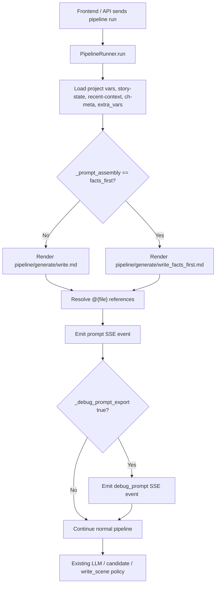

# T8.2 Facts-first Prompt Assembly Product Experiment

## 1. Background

T8.1 showed that facts-first prompt ordering was the best narrow next step: it matched the current-like assembly score while reducing latency in the benchmark. T8.2 implements that idea as a guarded product experiment, not as a default workflow change.

This task does not productize Scene Plan + Checker, does not add a checker gate, and does not change candidate adoption, file-save conflict handling, LLM provider settings, release tags, or frontend product flow.

## 2. Implementation Scope

Implemented behind explicit flags:

- `extra_vars._prompt_assembly = "facts_first"` selects the experimental facts-first scene-writing prompt.
- `extra_vars._debug_prompt_export = true` emits a `debug_prompt` SSE event containing the final rendered prompt and safe metadata.

Default behavior is unchanged. Without these flags, `pipeline/generate/write.md` remains the scene-writing prompt.

## 3. Product Chain

## 4. Debug Prompt Export

The debug payload is emitted only when explicitly enabled. It includes:

- `task_id`
- `step_id`
- selected `template`
- `assembly`
- final rendered `prompt`
- `prompt_sha256`
- `prompt_length`
- a boolean summary of included context blocks

It does not include API keys, provider configuration, headers, cookies, or local workspace paths beyond the normal target path already present in the prompt.

This is intentionally an SSE debug export, not a durable file write. It is suitable for manual benchmark capture and frontend debug panels without creating raw prompt artifacts in the repository or workspace.

## 5. Facts-first Assembly

The experimental template moves hard facts ahead of narrative context:

1. current scene identity;
2. immutable facts from `facts_block`, story state, recent context, continuity anchors, foreshadowing, and active quests;
3. forbidden changes;
4. scene goal;
5. previous/current scene text;
6. style guide and outline;
7. existing writing rules include;
8. silent self-check and output requirements.

The template keeps the project's non-negotiable writing unit:

- `sec-*.md` means one scene;
- target length remains about 800 Chinese characters;
- allowed range remains 600-1000 Chinese characters;
- output must be current scene prose only.

## 6. Safeguards

- Facts-first is opt-in and never selected by default.
- Unknown `_prompt_assembly` values fall back to `default`.
- Debug prompt export is opt-in and accepts only explicit true-like values.
- Candidate/write behavior is untouched. `write_scene`, `candidate`, `append`, and legacy normalization still flow through existing output policy.
- The `write_next_scene` action still keeps `output_mode=write_scene` in dry-run tests.
- The existing `prompt` SSE event remains unchanged for current frontend behavior.

## 7. Real LLM Comparison

Model: `agnes-2.0-flash`

Method:

- Direct Agnes OpenAI-compatible API call.
- Three cases from the T8 continuity family.
- Two variants per case:
  - A: current-like order.
  - B: facts-first order.
- Temperature: 0.1.
- Max tokens: 650.
- No product workspace writes.
- No candidate generation.
- No API key recorded.

Note: The Agnes MCP call path timed out during this run, so the smoke used the same provider through direct API access from local configuration. The key was read only in memory and was not printed or written.

| Case | Variant | Result | Issues | Time |
| --- | --- | --- | --- | ---: |
| injury-state | A current-like | Pass | None detected | 3.29s |
| injury-state | B facts-first | Pass | None detected | 1.61s |
| item-ownership | A current-like | Pass | None detected | 14.13s |
| item-ownership | B facts-first | Pass | None detected | 3.05s |
| no-new-entities / foreshadowing | A current-like | Partial | Did not mention "第七层协议" | 2.23s |
| no-new-entities / foreshadowing | B facts-first | Partial | Did not mention "第七层协议" | 1.90s |

Summary:

| Variant | Passes | Logic Issue Cases | Average Time | Product Conclusion |
| --- | ---: | ---: | ---: | --- |
| A current-like | 2/3 | 1/3 | 6.55s | Baseline remains usable |
| B facts-first | 2/3 | 1/3 | 2.19s | Worth keeping as opt-in experiment |

## 8. Findings

1. Facts-first did not degrade hard-logic behavior in this small smoke run.
2. Facts-first was faster in all three cases in this run, though the sample is too small to claim stable latency improvement.
3. Both variants failed the same foreshadowing target by omitting "第七层协议", which suggests ordering alone cannot guarantee required-beat completion.
4. The injury and item ownership samples passed in both variants, so T8.2 does not justify replacing the default prompt.
5. Debug prompt export is valuable because it gives an exact final prompt for later analysis without touching product output behavior.

## 9. Test Coverage

Added backend tests cover:

- default prompt assembly remains unchanged;
- facts-first switch selects the experimental template;
- debug prompt export emits the final rendered prompt and checksum;
- debug export requires an explicit flag;
- unknown assembly values fall back to default;
- `write_next_scene` / `write_scene` output mode is not changed by the experiment flag.

## 10. Recommendation

Keep facts-first as a guarded experiment and do not make it the default yet.

Proceed to a larger T8.2.1 sample if needed:

- at least 20 cases;
- real rendered product prompts captured through `debug_prompt`;
- separate scoring for required-beat omission versus hard contradiction;
- additional required-beat reinforcement before considering any default prompt change.

Do not enter T8.3 Scene Plan + Checker productization based only on this result.
