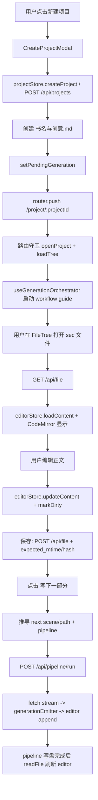
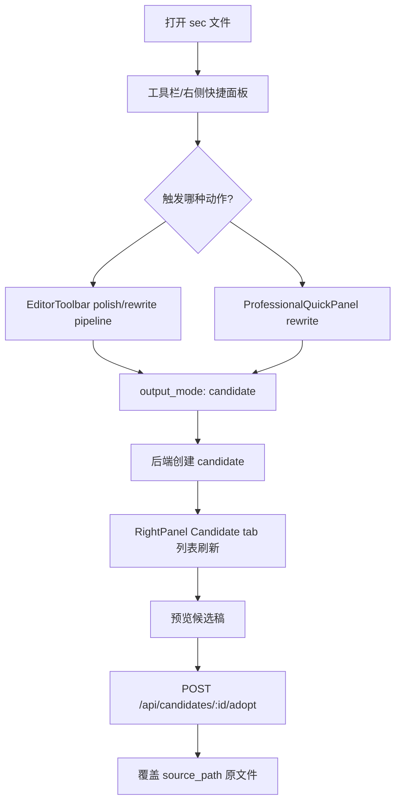
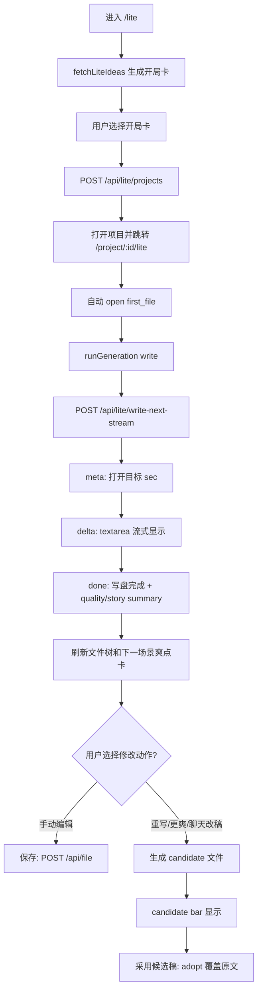
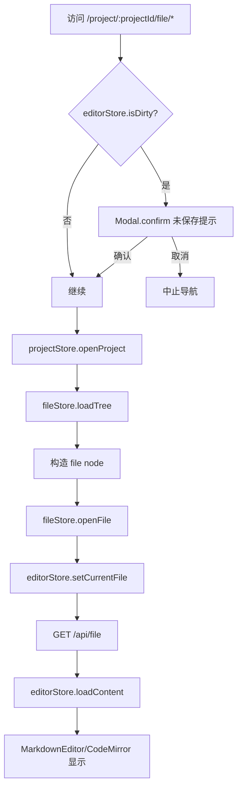

# Frontend User Flow / 前端真实用户流程

本文档基于当前 `frontend/src` 代码梳理真实用户流程，用于后续重新设计 E2E 测试。当前产品不是“点击按钮直接生成正文”的单一链路，而是由项目、文件树、编辑器、管线、候选稿、SSE、Lite 流式写作共同组成。

## 1. 入口总览

| 入口 | 页面组件 | 是否需要已有项目 | 主要 store | 文件树 | 编辑正文 | 调用 LLM | 写入文件 | 候选稿 | Memory |
|---|---|---:|---|---|---|---|---|---|---|
| `/` | `AppLayout` | 否 | `project`、`file`、`editor`、`ui`、`llm`、`task` | 有项目时加载 | 选中文件后可编辑 | 可，通过工具栏/右侧面板 | 保存、pipeline、generate 都可能写 | 右侧 Candidate tab | 右侧 story/recent 面板读取 |
| `/project/:projectId` | `AppLayout` | 是 | `project`、`file`、`editor` | 路由守卫和 `FileTree` 都会加载 | 可编辑打开的文件 | 可，通过 `write-next`、pipeline、workflow | 会写目标文件 | pipeline 可能生成 candidate | pipeline/Lite/Memory API 可能更新 |
| `/project/:projectId/file/*` | `AppLayout` | 是 | `project`、`file`、`editor` | 需要时加载 | 直接读取该文件并显示 | 取决于后续按钮 | 保存会写该文件 | 取决于后续按钮 | 取决于后续按钮 |
| `/lite` | `LiteWritingView` | 否 | `project`、`file`、`editor`、`notification` | 不加载项目树 | 未创建项目前不可编辑正文 | 可，生成开局卡 | 创建项目后才写 | 创建项目后可生成 candidate | 创建项目后维护 story-engine |
| `/project/:projectId/lite` | `LiteWritingView` | 是 | `project`、`file`、`editor` | 路由守卫加载 | 使用 textarea 编辑当前场景 | 可，生成爽点卡/正文/候选稿 | 正文写 sec，候选稿写候选路径 | 重写/更爽/更合理/聊天改稿会走候选稿 | 会读写 story-engine/recent-context/ch-meta |

### `/`

- 组件：`AppLayout`，由 `AppHeader`、`FileTree`、`EditorTabs`、`EditorToolbar`、`MarkdownEditor`、`ChatPanel`、`RightPanel` 组成。
- 不要求已有项目。无项目时文件树和编辑器显示创建/打开项目入口。
- `App.vue` 初始化应用、连接 SSE、加载持久化 store，并注册所有全局 modal。
- 可以通过顶部“新建”“打开”进入项目流程。
- 只有打开项目并选中文件后，编辑器才有正文内容。

### `/project/:projectId`

- 组件：`AppLayout`。
- 路由守卫会执行 `projectStore.openProject(projectId)` 和 `fileStore.loadTree(projectId)`。
- `App.vue` mounted 时也会从 URL 恢复项目，并默认打开 `outline.md` 或第一个 Markdown 文件。
- 文件树可打开任意文件，编辑器通过 `fileStore.readFile` 读取内容。
- 工具栏可保存、预览、写下一部分、运行 pipeline、批量生成、质量审查等。

### `/project/:projectId/file/*`

- 组件：`AppLayout`。
- 路由守卫会检查 `editorStore.isDirty`，有未保存内容时弹确认。
- 若项目未加载，先 `openProject` 和 `loadTree`。
- 根据 URL path 构造文件节点，调用：
  - `fileStore.openFile(node)`
  - `editorStore.setCurrentFile(filePath)`
  - `fileStore.readFile(projectId, filePath)`
  - `editorStore.loadContent(filePath, content)`
- 这是“直接定位文件”的入口，不自动生成。

### `/lite`

- 组件：`LiteWritingView`。
- `onMounted` 无 projectId 时执行 `projectStore.closeProject()`，然后 `loadIdeas(false)`。
- 首屏是 5 张开局卡，调用 `fetchLiteIdeas` 或预取缓存。
- 用户选开局卡后调用 `createLiteProject(card, prefs)`，创建项目、加载文件树、跳转 `/project/:projectId/lite`，并自动写第一场景。

### `/project/:projectId/lite`

- 组件：`LiteWritingView`。
- 路由守卫打开项目并加载文件树。
- 页面自己决定打开哪个章节，不使用主工作台默认打开 `outline.md` 的逻辑。
- 左侧列出 `chapters/**/sec-*.md`，中间 textarea 是 Lite 编辑器，右侧是爽点卡、聊天改稿、参数、故事状态摘要。
- 选爽点卡会直接调用流式接口写下一场景；重写/更爽/更合理/聊天改稿会生成候选稿，不覆盖原文，需用户采用。

## 2. 主工作台流程

### 2.1 创建项目

入口位置：

- 顶部 `AppHeader` 的“新建”按钮。
- 无项目时 `FileTree` 和 `MarkdownEditor` 欢迎页里的创建按钮。

实际链路：

1. `uiStore.openCreateProject()` 打开 `CreateProjectModal`。
2. 用户填写项目名、题材、文风、基调、背景、主题、规模等。
3. 点击“生成并打开”前会检查 `llmStore.isConnected`；未连接则打开设置，不创建项目。
4. `useProjectWizard.createProject` 调用 `projectStore.createProject`。
5. `projectStore.createProject` 调用 `POST /api/projects`，成功后设置 `currentProject`。
6. `CreateProjectModal` 额外创建 `书名与创意.md`。
7. 设置 `projectStore.pendingGeneration`，包含 `filePath`、`promptType: generate/title` 和创作参数。
8. 路由跳转 `/project/{project.id}`。
9. `useGenerationOrchestrator` 监听到 `pendingGeneration`，打开目标文件，并调用 `useWorkflowGuide().start(projectId, filePath)` 启动完整创作工作流。

结论：新建项目不是只创建目录，也不是立刻写正文；它会创建初始文件，并通过 workflow guide 触发后续生成流程。

### 2.2 创建项目后进入哪个路由

- 专业模式创建后进入 `/project/:projectId`。
- Lite 模式创建后进入 `/project/:projectId/lite`。
- 顶部模式切换按钮在已有项目时在 `/project/:projectId` 与 `/project/:projectId/lite` 间切换，并先检查未保存内容。

### 2.3 文件树如何加载

文件树由 `fileStore.loadTree(projectId)` 加载：

- 路由守卫会加载。
- `FileTree` watch `projectStore.currentProject` 会加载。
- 生成、批量生成、创建/重命名/删除文件后会刷新。
- 后端返回 path 可能带 projectId 前缀，前端会在 `stripTreePathPrefix` 去掉。

### 2.4 用户如何打开 sec 文件

用户在左侧 `FileTree` 点击文件：

1. `FileTree.handleFileClick(node)`。
2. `fileStore.readFile(projectId, node.path)` 调用 `GET /api/file`。
3. `fileStore.openFile(node)` 加入 tabs。
4. `editorStore.loadContent(node.path, fileData.content)`。
5. `editorStore.setCurrentFile(node.path)`。
6. `MarkdownEditor` watch `fileStore.currentFile` 创建 CodeMirror。

`/project/:projectId/file/*` 路由也是同样逻辑，只是由 URL 直接触发。

### 2.5 编辑器如何读取和保存文件

读取：

- `fileStore.readFile(projectId, path)` 调用 `GET /api/file?project_id=&path=`。
- 内容和 `mtime/hash` 存入 `fileStore.fileContents[path]` / `fileStore.fileMeta[path]`，正文进入 `editorStore.contents[path]`。

编辑：

- CodeMirror 变化触发 `MarkdownEditor.handleContentChange`。
- 调用 `editorStore.updateContent(path, content)`。
- `fileStore.markDirty(path)` 标记未保存。
- `useAutoSave` 会被触发，但具体自动保存策略需单独看 composable。

保存：

- 保存按钮通常经 `EditorToolbar` 或快捷键调用 `fileStore.saveFile(projectId, path, content)`。
- API 是 `POST /api/file?project_id=...`，body 包含 `path`、`content`、`expected_mtime`、`expected_hash`。
- 如果后端返回 `FILE_CONFLICT`，前端提示用户重新加载服务器版本或取消保存，不静默覆盖。

### 2.6 “写下一部分”实际做什么

按钮位置：`EditorToolbar`，`data-testid="write-next-button"`。

前置条件：

- 有当前项目。
- 当前文件不是系统文件（`style-guide.md`、`story-state.md`、`recent-context.md`、`.json` 不显示/不可走）。
- LLM 已连接。
- 已打开一个文件。

实际逻辑在 `EditorToolbar.handleGenerateNext`：

1. 从 `editorStore.currentFilePath` 推导下一步：
   - 如果当前是 `chapters/vol-NN/ch-NNN/sec-NNN.md`，调用 `getNextScenePath` 得到下一场景文件。
   - 如果当前在项目初始化链上，按 `style-guide.md → blueprint.md → outline.md → worldbuilding.md → characters/main.md → sec-001.md` 推进。
   - 不在链上且不是场景时，从 `style-guide.md` 开始。
2. 根据目标文件推导 pipeline，例如场景文件使用 `generate`。
3. `pipelineStore.fetchPipelineDetail(next.pipeline)` 查看第一步是否需要确认。
4. 如果需要确认，会先打开目标文件 tab，并加载右侧 prompt。
5. 调用 `fileGen.runPipeline(projectId, next.path, next.pipeline, extraVars)`。
6. `useFileGeneration.runPipeline` 调用 `POST /api/pipeline/run`，body 包含：
   - `pipeline`
   - `project_id`
   - `target_file`
   - `output_mode: write_scene`
   - `extra_vars`
7. 返回是 fetch + ReadableStream 的 SSE 流。
8. `parseSSEStream` 将事件转发到 `generationEmitter`。
9. `useSSE` 监听 `generationEmitter`，把 `generation.delta` append 到目标文件的 editor buffer。
10. pipeline 结束后，`runPipeline` 再调用 `fileStore.readFile(projectId, targetFile)` 从磁盘重新读取最终内容，刷新 editor。

结论：

- 它不是简单“点击按钮直接生成正文”。
- 它先推导下一文件和 pipeline。
- 它通过 pipeline 流式写入新场景或空场景；若目标已有内容，后端应转候选稿或要求确认，不能静默覆盖。
- 前端流式显示来自 fetch stream + `generationEmitter`。
- 最终内容以后端写盘结果为准，再读回 editor。

### 2.7 生成完成后 UI 如何变化

主工作台 pipeline 完成后：

- CodeMirror 中目标文件内容会流式增加。
- pipeline 结束后重新读取目标文件内容并刷新 editor。
- `fileStore.unsavedFiles.delete(targetFile)` 清除脏标记。
- 任务、日志、LLM 状态通过 `useSSE`、`taskStore`、`llmStore` 更新。
- 文件树是否刷新取决于事件和调用方：
  - `file-created` / `candidate-created` 会刷新文件树。
  - `file-updated` 默认不读正文，只在带 content 时更新 editor。
  - `BatchGenerateModal` 成功后显式 `fileStore.refreshTree()`。
- `recent-context` / `story-state` 是否更新取决于后端 pipeline；前端只负责显示 story/recent 面板或接收 `memory-updated`。

### 2.8 重写 / 润色按钮实际做什么

主工作台有两组相近按钮：

1. `EditorToolbar` 上的“润色 / 精修 / 提取”
   - 只在场景文件 `sec-*.md` 上显示。
   - 调用 `runPipeline('polish' | 'rewrite' | 'extract')`。
   - `polish` / `rewrite` 属于高风险修改，默认使用 `output_mode: candidate`，不直接覆盖正式正文。
   - `extract` 输出到 `materials/extracted/...`，不覆盖当前场景。
   - 用户在 Candidate 面板点击采用后，候选稿才覆盖 `source_path`。

2. 右侧 `ProfessionalQuickPanel`
   - “续写当前场景”调用 `generationStore.continueWriting`，再调用 `POST /api/generate`，`mode: append`。
   - “重写当前场景”调用 `generationStore.rewriteContent`，默认生成 candidate，不直接覆盖正式正文。
   - 该 store 当前主要建立任务状态；流式事件由 `useSSE`/fetch stream 处理。

候选稿面板：

- 位置：右侧 `RightPanel` 的 Candidate tab。
- 组件：`CandidatePanel`。
- 列表 API：`GET /api/candidates/{projectId}`。
- 详情 API：`GET /api/candidates/{projectId}/{candidateId}`。
- 采用 API：`POST /api/candidates/{projectId}/{candidateId}/adopt`。
- 删除 API：`DELETE /api/candidates/{projectId}/{candidateId}`。
- 采用会覆盖 `source_path` 对应原文件。

结论：主工作台并非所有“重写/润色”都先进入候选稿。Candidate 是独立面板和后端能力；是否产生候选稿要看触发的 pipeline/API。

## 3. LiteWritingView 流程

### 3.1 Lite 页面定位

Lite 是爽文/轻量写作入口，目标是减少用户理解 prompt、workflow、文件树的成本。

它的核心交互是：

- 无项目：选开局卡创建项目。
- 有项目：选下一场景爽点卡，自动流式写入下一场景。
- 对当前场景进行重写/更爽/更合理/聊天改稿时，生成候选稿，用户满意后采用。

### 3.2 是否需要项目

- `/lite` 不需要项目，会展示开局卡。
- `/project/:projectId/lite` 需要项目，会加载项目、文件树、章节列表和故事状态。

### 3.3 没有项目时如何工作

1. `projectStore.closeProject()`。
2. `loadIdeas(false)`。
3. `fetchLiteIdeas(seed)` 调用 `POST /api/lite/ideas`，或消费预取缓存。
4. 用户点击开局卡触发 `startProject(card)`。
5. `createLiteProject(card, prefs)` 调用 `POST /api/lite/projects`。
6. 成功后：
   - `projectStore.openProject(created.project_id)`
   - `fileStore.loadTree(created.project_id)`
   - `router.push('/project/{id}/lite')`
   - `openChapter(created.first_file, { skipOptions: true })`
   - 构造一张 openingCard 并 `runGeneration(openingCard, 'write', first_file)`

因此 Lite 新项目创建后会自动进入项目态，并开始写第一场景。

### 3.4 带 projectId 时如何读取上下文

- 路由守卫和 `openProject(id)` 加载项目与文件树。
- `chapterFiles` 从 `fileStore.tree` 中筛选 `chapters/**/sec-*.md`。
- `openChapter(path)` 读取当前场景内容。
- `refreshOptions(currentFile)` 调用 `fetchLiteNextOptions(projectId, currentFile, prefs)`，后端根据当前文件、前文、story engine、recent context 生成下一场景爽点卡。
- 页面故事状态摘要来自后端返回或本地更新的 `engineSummary`。

### 3.5 用户点击生成时调用什么

Lite 右侧爽点卡点击：

- `generateWithCard(card)`。
- `runGeneration(card, 'write', nextTargetFile || null)`。
- `streamLiteNext(...)` 调用 `POST /api/lite/write-next-stream`。
- 请求体包含 `project_id`、`target_file`、`output_file`、`selected_card`、`prefs`、`action`。

Lite 聊天改稿：

- 用户在“灵感改稿”输入框输入要求。
- 点击“生成候选稿”。
- `runChatRevision()` 构造一张 chat revision card。
- `runGeneration(card, 'rewrite', sourcePath, buildChatRevisionPath(sourcePath))`。
- 因为传了 `outputFile` 且不同于 sourcePath，所以这是 candidate 流程。

### 3.6 生成结果显示在哪里

- `onMeta` 后立即打开/切换到 `meta.file_path`。
- 中间 textarea 先显示 heading + “AI 正在起笔...”占位。
- `onDelta` 将增量写入 `streamingBuffers[filePath]`，如果当前正在查看该文件，就同步到 textarea。
- `editorStore.loadContent(filePath, nextContent)` 同步主编辑器 store。
- 用户在流式输出期间可以切换章节；只要不是当前流式文件，textarea 不会被强行覆盖。

### 3.7 是否写入文件，写入哪里

Lite 的 `write` action：

- 会写入 `chapters/vol-NN/ch-NNN/sec-NNN.md`。
- 下一路径由后端返回 `meta.file_path` / `done.file_path`，前端显示 `nextTargetFile`。
- 每个 `sec-*.md` 是一个完整场景。

Lite 的 `rewrite` / `more_exciting` / `more_reasonable` / `chat revision`：

- 如果有 `outputFile`，写到候选稿路径，不覆盖原文件。
- 页面显示 candidate bar，用户可“采用候选稿”或“放弃”。

### 3.8 保存、采用、复制

- Lite textarea 手动修改后，点击“保存”调用 `saveCurrent()`，通过 `fileStore.saveFile` 写当前 `currentFilePath`。
- 如果正在查看 candidate，保存按钮禁用，防止直接把候选稿当原文编辑保存。
- 候选稿采用调用 `acceptCandidate()`，具体 API 走 candidate adopt。
- 当前代码未看到专门的“复制”动作。

### 3.9 是否更新 candidate

会。以下动作走 candidate：

- “重写当前场景”
- “让当前场景更爽”
- “让当前场景更合理”
- “灵感改稿”

这些动作通过 `outputFile` 与 `targetFile` 不同来标记 candidate；页面在 `candidateDraft` 存 sourcePath、candidate path、action、content。

### 3.10 是否更新 recent-context / story-state

Lite 流式完成后 `onDone` 会接收：

- `quality_summary`
- `story_engine_summary`
- `chapter_plan`

前端显示质量摘要和故事状态摘要。实际 `story-engine.md`、`recent-context.md`、`ch-meta.json` 的写入发生在后端 `/api/lite/write-next-stream` 流程中；前端完成后会 `fileStore.loadTree(projectId)` 并刷新下一场景爽点卡。

### 3.11 Lite 与主工作台共享什么

共享：

- LLM 配置：`llmStore` 与后端 config。
- 当前项目：`projectStore.currentProject`。
- 文件树：`fileStore.tree`。
- 当前文件和内容：`editorStore`，Lite 也会 `editorStore.setCurrentFile/loadContent`。
- Candidate 后端存储：Lite 候选稿和主工作台 Candidate tab 使用同一项目 candidate 数据。
- Story memory 文件：`story-engine.md`、`recent-context.md`、`story-state.md`、`ch-meta.json` 在同一项目目录。
- SSE/task 状态：主工作台使用全局 `useSSE`；Lite 的正文生成主要使用 fetch stream 自己处理，但仍共享项目和文件 store。

不完全共享：

- Lite 的 textarea 不是 CodeMirror。
- Lite 的 `streamLiteNext` 不依赖主工作台 `useFileGeneration`。
- Lite 的爽点卡和参数面板是独立 UI，不直接暴露完整 prompt。

## 4. Mermaid 流程图

### 4.1 主工作台：创建项目 → 打开 sec → 保存 → 写下一部分

### 4.2 主工作台：重写/润色 → candidate → adopt

### 4.3 Lite：输入设定 → 生成 → 显示/保存/采用

### 4.4 `/project/:projectId/file/*`：加载项目 → 读取文件 → 编辑器显示

## 5. E2E 测试应如何设计

| 测试名称 | 入口 | 用户动作 | 期望 UI 变化 | 期望 API | 真实 LLM | 文本质量 | 落盘 | Candidate | Memory |
|---|---|---|---|---|---:|---:|---:|---:|---:|
| 主入口空项目页 smoke | `/` | 打开页面 | header、文件树空态、欢迎编辑器可见 | 可检查 `/api/config`/初始化 | 否 | 否 | 否 | 否 | 否 |
| 新建项目进入工作台 | `/` | 打开新建 modal，填写题材，提交 | 跳转 `/project/:id`，文件树出现 | `POST /api/projects`、`POST /api/file/create` | 可 mock | 否 | 是，初始文件 | 否 | 可不查 |
| URL 打开指定 sec | `/project/:id/file/chapters/.../sec-001.md` | 直接访问 | CodeMirror 显示该文件内容 | `GET /api/file` | 否 | 否 | 否 | 否 | 否 |
| 主工作台保存正文 | `/project/:id/file/...sec-001.md` | 编辑 CodeMirror，保存 | 脏标记消失/通知成功 | `POST /api/file` | 否 | 否 | 是 | 否 | 否 |
| 写下一部分 pipeline smoke | `/project/:id/file/...sec-001.md` | 点“写下一部分” | 打开/切换到下一 sec，生成中状态出现 | `GET /api/pipeline/{name}`、`POST /api/pipeline/run` | 可 mock；真实 LLM 单独测 | 否或轻量检查 | 是 | 不强制 | 可检查后端产物 |
| 主工作台 pipeline 输出刷新 | `/project/:id/file/...sec-001.md` | 让 mock pipeline 返回内容 | editor 流式追加，完成后 readFile 刷新 | fetch stream + `GET /api/file` | 否 | 否 | 是 | 否 | 可不查 |
| 主工作台 candidate 面板 | `/project/:id` | 打开 Candidate tab | candidate 列表显示 | `GET /api/candidates/:projectId` | 否 | 否 | 否 | 是 | 否 |
| 采用候选稿 | `/project/:id` | 预览 candidate，点击采用 | 状态更新/通知成功 | `GET /api/candidates/:id`、`POST /api/candidates/:id/adopt` | 否 | 否 | 是，覆盖 source | 是 | 否 |
| Lite 无项目入口 | `/lite` | 打开页面 | 5 张开局卡或加载态可见 | `POST /api/lite/ideas` | 可 mock | 否 | 否 | 否 | 否 |
| Lite 创建项目并写第一场景 | `/lite` | 选开局卡 | 跳转 `/project/:id/lite`，textarea 流式显示 | `POST /api/lite/projects`、`POST /api/lite/write-next-stream` | 可真实 LLM 独立测 | 是，真实 LLM 时检查 | 是，sec 文件 | 否 | 是，story engine |
| Lite 选爽点卡写下一场景 | `/project/:id/lite` | 选右侧爽点卡 | 目标 sec 打开，流式输出，下一批卡刷新 | `POST /api/lite/write-next-stream`、`POST /api/lite/next-options` | 可 mock/真实各一套 | 真实时检查 | 是 | 否 | 是 |
| Lite 重写生成候选稿 | `/project/:id/lite` | 点“重写/更爽/聊天改稿” | candidate bar 出现，原文不被覆盖 | `POST /api/lite/write-next-stream` 带 `output_file` | 可 mock | 可不查 | 是，候选路径 | 是 | 可不查 |
| Lite 采用候选稿 | `/project/:id/lite` | 点击“采用候选稿” | candidate bar 消失，正文替换 | candidate adopt API | 否 | 否 | 是，覆盖 source | 是 | 可不查 |
| 批量生成场景 | `/project/:id` | 更多 → 批量生成 | modal 展示结果表，文件树刷新 | `POST /api/generate/batch` | 可真实 LLM 少量测 | 真实时检查 | 是或 candidate | 可能 | 可能 |
| 设置不明文泄露 API Key | `/` | 打开设置保存配置 | localStorage 不出现明文 key | config API | 否 | 否 | 否 | 否 | 否 |

建议分层：

- CI smoke：mock 或本地后端，不要求真实 LLM。
- 真实 LLM E2E：少量、明确标记、可跳过；只覆盖 Lite 首节、主工作台下一场景、候选稿采用。
- 质量评估：不要混在普通 smoke 中；只对真实 LLM 生成文本检查“非提示词泄露、非大纲格式、字数/连续性大致达标”。

## 6. 之前测试计划中的错误假设

1. “点击按钮直接生成正文”不准确。
   - 主工作台“写下一部分”会先推导目标文件和 pipeline，再通过 `/api/pipeline/run` 流式运行。
   - Lite 的爽点卡是“选卡即写”，但也会经过 `/api/lite/write-next-stream` 的 meta/delta/status/done 流程。

2. “所有生成都直接写正文”不准确。
   - Lite 的 write action 写 sec 正文。
   - Lite 的重写/更爽/更合理/聊天改稿生成 candidate，不覆盖原文。
   - 主工作台 polish/rewrite 是否 candidate 取决于后端 pipeline/API，不应在 E2E 中默认假设。

3. “生成结果一定在当前 editor 立即完整出现”不准确。
   - 主工作台 pipeline 先通过 stream append，再在完成后 readFile 刷新最终内容。
   - Lite 支持流式期间切换章节；非当前流式文件不应强制覆盖 textarea。

4. “Lite 入口无项目也能直接保存正文”不准确。
   - `/lite` 无项目时只显示开局卡。
   - 选卡创建项目后才会写入项目文件。

5. “文件树一定自动同步正文更新”不完全准确。
   - file.updated 不带 content，前端通常只记录日志。
   - 创建/候选稿创建会刷新文件树；部分生成流程完成后会显式 loadTree/refreshTree。

6. “按钮总是可用”不准确。
   - 主工具栏写作按钮依赖当前项目、当前文件、LLM 连接和系统文件判断。
   - 场景专属按钮只在 `sec-*.md` 文件上出现。
   - Lite 的选卡、保存、候选稿采用都受 `generating`、`saving`、`currentFilePath`、`isViewingCandidate` 影响。

7. “recent-context/story-state 一定由前端更新”不准确。
   - 前端主要读取和展示 story/recent。
   - 生成后的记忆更新主要在后端 pipeline 或 lite stream 中发生，前端通过结果、事件和刷新读取。

## 7. 后续测试编写注意事项

- E2E 应先明确入口和状态：无项目、已有项目、已打开文件、已连接 LLM 是四种不同前置条件。
- 不要跳过文件选择：很多按钮只有当前文件存在才有意义。
- 对主工作台生成要监听 pipeline/fetch stream，而不是只等待一个普通 POST 返回。
- 对 Lite 生成要监听 textarea 流式变化和 done 后文件落盘。
- Candidate 测试必须区分“生成候选稿”和“采用候选稿覆盖原文”两个动作。
- Memory 测试应检查 `story-engine.md`、`recent-context.md`、`story-state.md` 或 `ch-meta.json` 的实际文件变化，而不是只看 UI 摘要。
