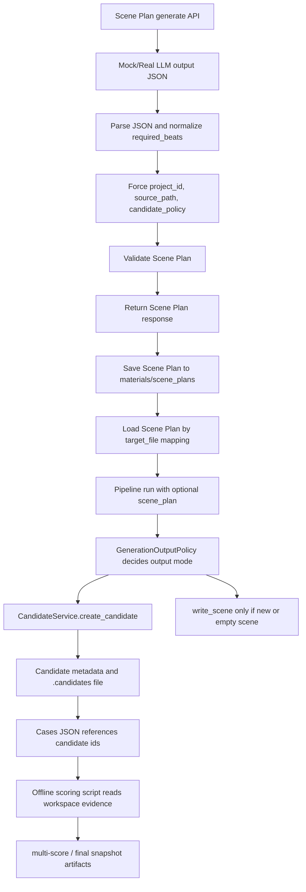

# T5.17-pre Scene Plan Chain Architecture Audit

审计日期: 2026-06-09

审计目标: 检查 Scene Plan 生成、保存、Pipeline dry-run、Candidate 创建、Scoring 输入、Workspace 安全边界之间是否存在结构性风险。本轮只做架构审计和最小测试建议，不调用真实 LLM，不生成 Scene Plan，不生成 candidate，不 adopt，不修改 workspace，不修改评分产物。

## 1. 审计范围

### A. Scene Plan API

已检查:

- `backend/api/scene_plan.py`
- `backend/schemas/scene_plan.py`
- `backend/core/llm.py`
- `backend/core/scene_plan_validator.py`
- `tests/test_scene_plan_generate_api.py`
- `tests/test_scene_plan_validate_api.py`
- `tests/test_scene_plan_persistence_api.py`
- `tests/test_scene_plan_validator.py`
- `tests/test_scene_plan_pipeline_integration.py`

重点关注:

- `/api/scene-plan/generate` 是否只生成 Scene Plan
- `include_raw_output=false` 是否不返回 raw output
- LLM 输出 JSON 解析和 required_beats 归一化
- `source_path` 与 `target_file` 是否绑定
- Scene Plan save/load 路径安全和 overwrite 语义
- 错误响应和日志是否泄露 prompt、raw output、API key

### B. Pipeline / Candidate

已检查:

- `backend/api/pipeline.py`
- `backend/core/pipeline.py`
- `backend/policies/generation_output_policy.py`
- `backend/policies/candidate_policy.py`
- `backend/core/candidate_service.py`
- `backend/api/candidates.py`
- `backend/schemas/candidate.py`
- `backend/domain/events.py`
- `frontend/src/components/right-panel/CandidatePanel.vue`

重点关注:

- `polish` / `rewrite` / 已有 `sec-*.md` 是否默认 candidate
- `output_mode=overwrite` 是否被安全收敛
- 是否有绕过 candidate 直接写 `target_file` 的路径
- candidate SSE payload 是否可被前端刷新
- candidate metadata 是否能追溯 baseline / with-plan

### C. Scoring

已检查:

- `scripts/eval/scene_plan_quality_score.py`
- `docs/testing/artifacts/t5-scene-plan-quality-cases-2026-06.json`

重点关注:

- scoring 是否离线
- 是否读取受控证据还是 workspace 原始 candidate
- case schema 是否足够绑定 Scene Plan 与 candidate snapshot
- `note` / `_note` 是否可能再次产生歧义

### D. Workspace Safety

已检查:

- `.gitignore`
- `AGENTS.md`
- `scripts/solo-guardrails.ps1`
- `scripts/solo-guardrails.sh`
- `scripts/ai-guardrails.ps1`
- `scripts/ai-guardrails.sh`
- `docs/solo-workflow.md`

重点关注:

- `workspace/`、`.env` 是否被保护
- 是否存在误 `git add` workspace 的风险
- 是否有 API key、raw_output、临时产物误提交风险

## 2. 当前链路图



关键意图:

- Scene Plan generate 只产出结构化规划，不写正文、不创建 candidate。
- Pipeline 才负责基于目标文件和 output policy 决定写入或 candidate。
- Scoring 应只消费可追溯、冻结的证据，而不是隐式依赖会变化的 workspace 原始文件。

## 3. 已确认安全项

1. `/api/scene-plan/generate` 当前实现只调用 `LLMService.complete_sync()` 并返回 Scene Plan 响应，没有调用 `FileService.write_file()`，也没有直接创建 candidate。
2. `include_raw_output` 默认值为 `false`，响应构造时只有显式请求才返回 `raw_output`。
3. generate API 会强制覆盖 LLM 返回的 `project_id`、`source_path`、`metadata.created_by` 和 `candidate_policy`，确保生成结果默认要求 candidate 且禁止 direct write。
4. `required_beats` 已有归一化逻辑，可以把 list 中的 dict 提取为字符串或 JSON 字符串。
5. Scene Plan save/load 使用 `FileService.validate_path()` 校验 `target_file`，并把文件映射到 `materials/scene_plans/*.scene-plan.json`，不会写入 `chapters/**/sec-*.md`。
6. `FileService._resolve_path()` 已覆盖空路径、绝对路径、Windows 绝对路径、UNC 或反斜杠前缀、`.git`、`.env`、`.config.json`、`node_modules`、`__pycache__` 等边界。
7. `GenerationOutputPolicy` 已把 `polish`、`rewrite`、高风险动作、已有内容的 `sec-*.md` 写入转为 candidate；旧 `output_mode=overwrite` 会被兼容接收并归一化，不应静默覆盖已有场景。
8. `CandidateService.create_candidate()` 会记录 `base_hash` 和 `base_mtime`；`adopt_candidate()` 会比较当前 hash/mtime，冲突时拒绝 adopt，并在成功覆盖前写 revision-log。
9. `candidate.created` domain event helper 带 `project_id`，payload 包含 `candidate_id`、`source_path`、`action`。
10. Scoring 脚本未发现 LLM、OpenAI、LiteLLM、requests 等调用路径，属于离线评分。
11. `.gitignore` 已忽略 `.env` 和 `workspace/`，AGENTS 也明确禁止修改 workspace 和 `.env`。

## 4. 发现的问题

### High Risk

#### H1. Scene Plan 与目标场景缺少全链路强绑定

generate API 会把 `scene_plan.source_path` 强制设置为请求的 `target_file`，但 save/load/pipeline 并没有统一校验:

```text
request.target_file == scene_plan.source_path
```

风险:

- 用户或脚本可能把 A 场景的 Scene Plan 保存到 B 场景对应的 plan path。
- Pipeline 接收 `target_file` 和 `scene_plan` 后只验证 Scene Plan 自身结构和安全策略，没有确认它属于当前 `target_file`。
- with-plan candidate 可能实际使用了错误场景的 plan，评测结论会被污染。

建议:

- 在 `save_scene_plan_api` 中拒绝 `scene_plan.source_path != request.target_file`。
- 在 `load_scene_plan_api` 中加载后也校验 `scene_plan.source_path == target_file`，不一致时返回 invalid。
- 在 `PipelineRunner.run()` 或 API 层增加同一校验，防止直接传错 plan。
- 增加测试: save/load/pipeline 对 mismatched `source_path` 均拒绝。

#### H2. Candidate provenance 不足，无法从 metadata 区分 baseline 与 with-plan

`CandidateInfo` 当前有 `workflow_run_id`、`model`、`pipeline_id`、`prompt_version`、`source_mode`、`base_hash`、`base_mtime`，但没有通用 `metadata` 或 `generation_context`。Pipeline 创建 candidate 时也没有传入 Scene Plan 使用信息。

风险:

- 只能依赖外部 cases JSON 判断 candidate 是否带 Scene Plan。
- 一旦 candidate_id、cases JSON 或 workspace 文件被替换，metadata 无法自证 baseline / with-plan。
- 后续 T5.17 做链路验证时，candidate 无法直接追溯 `scene_plan_path` 或 `scene_plan_hash`。

建议:

- 在 candidate metadata schema 中增加向后兼容字段:

```json
{
  "generation_context": {
    "pipeline": "polish",
    "output_mode": "candidate",
    "scene_plan_used": true,
    "scene_plan_source_path": "chapters/vol-01/ch-001/sec-001.md",
    "scene_plan_path": "materials/scene_plans/chapters__vol-01__ch-001__sec-001.scene-plan.json",
    "scene_plan_hash": "sha256:..."
  }
}
```

- 如果请求只传 Scene Plan 对象而没有 path，至少记录 `scene_plan_used`、`scene_plan_source_path`、`scene_plan_hash`。
- 增加测试: pipeline with scene_plan 创建的 candidate metadata 必须包含 `generation_context.scene_plan_used=true`。

### Medium Risk

#### M1. Scene Plan load mtime 读取位置疑似错误

`FileService.read_file()` 返回 `(content, frontmatter, mtime)`。`load_scene_plan_api` 当前读取为 `content, meta, _`，并返回 `meta.get("mtime")`。对 JSON 文件，`frontmatter` 通常为 `None`，mtime 应取第三个返回值。

风险:

- load API 可能一直返回 `mtime=None`。
- 前端或后续冲突检测无法正确判断 Scene Plan 文件版本。
- 现有 persistence test mock 成 `(content, {"mtime": ...}, {})`，掩盖了真实返回契约。

建议:

- 改为 `content, _, mtime = await file_service.read_file(full_path)` 并返回 `mtime=mtime`。
- 更新测试 mock，覆盖 JSON 文件真实返回 `(content, None, 12345.67)`。

#### M2. Scene Plan save 的 overwrite=true 缺少 expected_mtime 实际使用

`ScenePlanSaveRequest` 已定义 `expected_mtime`，但 save API 写入时没有传给 `FileService.write_file()`。

风险:

- 多人或多任务同时更新同一个 Scene Plan 时，`overwrite=true` 可能覆盖别人刚保存的 plan。

建议:

- 当 `overwrite=true` 且请求携带 `expected_mtime` 时，传入 `write_file(..., expected_mtime=request.expected_mtime)`。
- 增加冲突测试。

#### M3. JSON 提取策略对嵌套或多 JSON 输出不够严格

`_extract_json_from_output()` 的 fallback 使用贪婪正则 `(\{.*\})`，会截取第一个 `{` 到最后一个 `}`。

风险:

- LLM 输出多个 JSON 或正文包裹 JSON 时，可能解析到错误片段。
- 当前测试覆盖了 invalid JSON，但未覆盖 markdown fenced JSON、多 JSON、前后噪声和嵌套场景。

建议:

- 最小补测试: fenced JSON、前后说明文字、两个 JSON 对象时应拒绝或选择明确对象。
- 后续可改为括号栈扫描或要求严格 fenced JSON。

#### M4. 错误和 debug 日志可能泄露用户内容片段

generate API 默认不返回 raw_output，但存在:

- debug 日志输出 `raw_output[:200]`
- LLM 调用异常响应 `message=f"LLM 调用失败: {e}"`
- 保存异常响应 `message=f"保存失败: {e}"`

风险:

- provider 异常或 raw output 可能包含用户正文片段、prompt 片段或敏感配置路径。
- API key 未在代码中直接输出，但异常字符串不可完全信任。

建议:

- raw output 日志改为长度、hash、parse status，不记录正文片段。
- 对外错误信息使用通用描述，详细异常只进受控日志，且不要包含 prompt/raw_output。
- 增加测试: LLM 抛出包含敏感词的异常时，响应不包含该敏感内容。

#### M5. Scoring 读取 workspace 原始 candidate，证据不是冻结快照

`scene_plan_quality_score.py` 通过 `workspace/projects/{project_id}/.candidates/{candidate_id}{ext}` 读取候选稿，通过 workspace scene plan 路径读取 plan。

风险:

- workspace 是用户数据目录，会被后续操作修改。
- candidate_id 如果复用、文件后缀变化或旧文件残留，评分会读到非预期内容。
- cases JSON 缺少 `scene_plan_hash`、`candidate_snapshot_hash`，无法证明评分输入没有变化。

建议:

- cases schema 增加 `scene_plan_hash`、`baseline_candidate_snapshot_hash`、`with_plan_candidate_snapshot_hash`。
- 或把评分输入复制到 `docs/testing/artifacts/evidence/` 的只读快照，再由 scoring 读取快照。
- scoring 运行前校验 hash，不一致直接失败。

#### M6. `generate_multi_case_report()` 会重新写入固定 note

脚本生成 multi-case report 时写入固定 `note` 文案。Solo 正在清理 final JSON / note / `_note` 字段，本轮未修改脚本以避免冲突。

风险:

- 后续重跑 scoring 时可能重新引入被人工清理的 note 字段。
- note 与 `_note` 语义可能再次分叉。

建议:

- 待 Solo 完成 T5.16.2a 后，把 note 策略收敛为单一字段或完全移到 markdown 报告，不再写入 final JSON。

### Low Risk

#### L1. Pipeline candidate SSE 使用两类事件形态

Pipeline streaming 事件使用 `candidate_created`，domain event helper 使用 `candidate.created`。当前前端可能做了兼容，但事件契约层面需要持续确认。

建议:

- 在 event contract 中明确 streaming event 与 EventBus event 的兼容关系。
- 增加前端 smoke test: pipeline 产生 candidate 后 CandidatePanel 能刷新。

#### L2. Guardrail 未显式检查 staged workspace/test artifacts

`.gitignore` 已保护 `workspace/`，但 guardrail 脚本目前重点检查 API key localStorage、`output_mode=overwrite`、重复 candidate source_path 等，没有看到明确检查:

- 已暂存 `workspace/`
- `test_results/`
- `_t516_*`
- raw_output 临时文件

建议:

- 增加 pre-commit/guardrail 检查 `git diff --cached --name-only`，拒绝提交 `workspace/`、`.env`、`test-results/`、`playwright-report/`、`_t516_*`、含 `raw_output` 的临时产物。

#### L3. 源码注释和部分测试文本存在终端乱码显示

本次审计中多个文件在终端输出呈现 mojibake。功能逻辑不一定受影响，但会降低审计和交接可读性。

建议:

- 单独开低风险任务做编码/注释清理，不要与 T5.16.2a 的评分产物清理混在一起。

## 5. 建议修复项

### T5.17 前建议先补

1. 增加 Scene Plan 与目标场景强绑定:
   - save: `scene_plan.source_path == request.target_file`
   - load: loaded plan must match requested `target_file`
   - pipeline: `scene_plan.source_path == target_file`

2. 增加 candidate provenance:
   - `generation_context.scene_plan_used`
   - `scene_plan_source_path`
   - `scene_plan_path` 或 `scene_plan_hash`
   - `pipeline`、`output_mode`

3. 修复 Scene Plan load mtime:
   - 使用 `read_file()` 第三个返回值。

4. 收敛 raw_output/error 泄露:
   - 不在 debug log 打印 raw_output 内容片段。
   - 对外错误不透出 provider 原始异常。

5. Scoring 输入冻结:
   - cases 增加 hash。
   - 或新增 evidence snapshot 目录并从 snapshot 评分。

### 可进入 T5.17 后并行处理

1. guardrail 增强 staged file 检查。
2. event contract 明确 `candidate_created` 与 `candidate.created`。
3. 清理源码注释/测试文本乱码。
4. 收敛 `note` / `_note` 字段策略。

## 6. 最小测试建议

### Scene Plan API

1. `test_generate_required_beats_dict_normalized`
   - LLM 返回 `required_beats=[{"description":"..."}]`
   - 期望响应中的 `required_beats` 为 `list[str]`

2. `test_save_rejects_source_path_target_file_mismatch`
   - 请求 `target_file=sec-001.md`
   - body 中 `scene_plan.source_path=sec-002.md`
   - 期望 `saved=false`，错误字段指向 `source_path`

3. `test_load_rejects_mismatched_scene_plan_source_path`
   - 文件内容中的 `source_path` 与查询 `target_file` 不一致
   - 期望 `exists=true` 但 `scene_plan=None` 或 `valid=false`

4. `test_load_returns_mtime_from_read_file_third_value`
   - mock `read_file` 返回 `(content, None, 12345.67)`
   - 期望 `mtime=12345.67`

5. `test_generate_error_does_not_echo_sensitive_exception`
   - mock LLM 抛出含敏感字符串的异常
   - 期望响应不包含该敏感字符串

### Pipeline / Candidate

1. `test_pipeline_rejects_scene_plan_target_mismatch`
   - `target_file=sec-001.md`
   - `scene_plan.source_path=sec-002.md`
   - 期望不运行 pipeline，不创建 candidate

2. `test_pipeline_with_scene_plan_candidate_has_generation_context`
   - 带 Scene Plan 运行 polish
   - 期望 candidate metadata 包含 `scene_plan_used=true` 和 scene plan hash/source path

3. `test_pipeline_without_scene_plan_candidate_has_scene_plan_used_false`
   - 不带 Scene Plan 运行 polish
   - 期望 candidate metadata 可明确标记 baseline

4. `test_overwrite_existing_scene_still_candidate`
   - `output_mode=overwrite`
   - 目标 `sec-*.md` 已有内容
   - 期望创建 candidate，不覆盖原文

### Scoring

1. `test_scoring_fails_on_candidate_hash_mismatch`
   - cases 中 hash 与实际 candidate snapshot 不一致
   - 期望评分失败

2. `test_scoring_reads_snapshot_not_workspace`
   - workspace candidate 被修改
   - snapshot 不变
   - 期望评分使用 snapshot

3. `test_multi_case_report_does_not_reintroduce_deprecated_note`
   - 待 Solo 完成 T5.16.2a 后补

### Guardrail

1. `test_guardrail_rejects_staged_workspace`
2. `test_guardrail_rejects_staged_env`
3. `test_guardrail_rejects_raw_output_artifact`

## 7. 是否建议进入 T5.17

结论: 不建议直接进入完整 T5.17 生成/评测闭环。

原因:

- Scene Plan 与 `target_file` 的强绑定尚未贯穿 save/load/pipeline。
- Candidate metadata 无法自证 baseline / with-plan provenance。
- Scoring 仍读取 workspace 原始 candidate 和 Scene Plan，缺少 hash 或 snapshot 固化。

建议进入条件:

1. 先补 H1、H2 的最小代码和测试。
2. 至少为当前 T5.16.2 样本补充 `scene_plan_hash` 与 candidate snapshot hash。
3. Solo 的 T5.16.2a 清理完成后，再处理 note/_note 策略和 scoring 输出字段。

## 8. 是否需要修改 candidate metadata schema

需要。

推荐最小兼容方案:

- 在 `CandidateInfo` 增加 `generation_context: dict | None = None`，默认 `None`，不破坏旧 metadata。
- `CandidateService.create_candidate()` 增加可选 `generation_context` 参数。
- Pipeline 创建 candidate 时写入:

```json
{
  "pipeline": "polish",
  "output_mode": "candidate",
  "scene_plan_used": true,
  "scene_plan_source_path": "chapters/vol-01/ch-001/sec-001.md",
  "scene_plan_hash": "sha256:..."
}
```

如果可以传递 Scene Plan 文件路径，再增加:

```json
{
  "scene_plan_path": "materials/scene_plans/chapters__vol-01__ch-001__sec-001.scene-plan.json"
}
```

## 9. 本轮未执行事项

- 未调用真实 LLM。
- 未生成 Scene Plan。
- 未生成 candidate。
- 未执行 adopt。
- 未修改 workspace。
- 未修改 scoring/final/multi-score/errata/gap-analysis 产物。
- 未提交 API key 或 `.env`。
- 未改业务代码。

